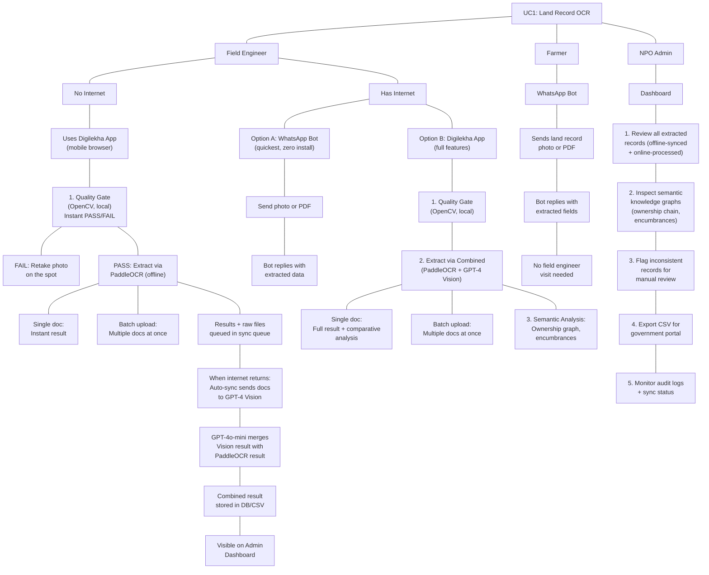
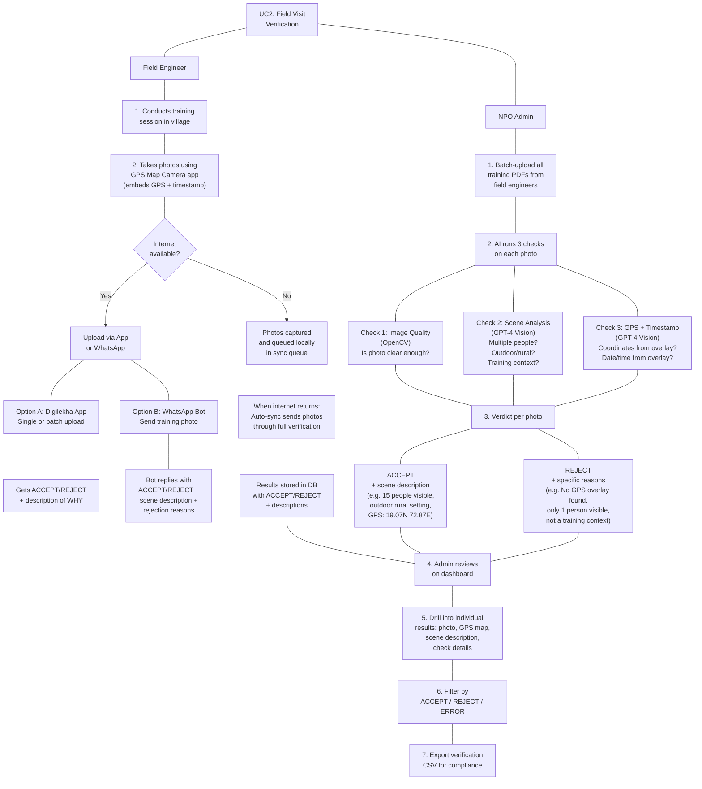
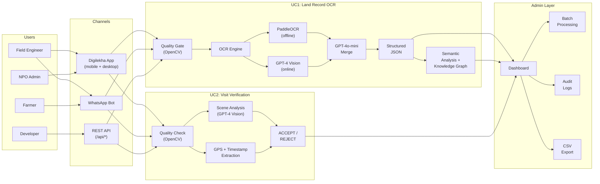
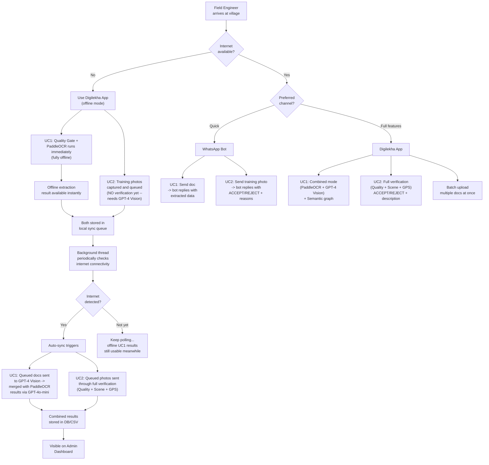

# Finals Pitch Overhaul Plan -- Digilekha

## Status Tracker

| # | Task | Status |
|---|------|--------|
| 1 | Apply 'Digilekha' branding across UI | DONE |
| 2 | Create mobile Field App (ui/views/mobile_demo.py) | DONE |
| 3 | Register mobile view in ui/app.py | DONE |
| 4 | Build lib/sync_queue.py (MongoDB sync queue) | DONE |
| 5 | Build lib/connectivity_monitor.py (auto-sync thread) | DONE |
| 6 | Create api/routers/sync.py (status + enqueue API) | DONE |
| 7 | Wire connectivity monitor into FastAPI lifespan | DONE |
| 8 | Add sync status to admin Dashboard (home.py) | DONE |
| 9 | WhatsApp: UC1 only, skip UC2, guide to mobile app | DONE |
| 10 | Design PPT Slide 3 flow diagram spec | PENDING |
| 11 | Write user story scripts (Raju, Meena, Priya) | PENDING |
| 12 | Integrate UC2 visit verification in pitch narrative | PENDING |
| 13 | Write 3-minute demo walkthrough script | PENDING |
| 14 | Create offline vs online comparison visual | PENDING |
| 15 | WhatsApp demo prep (screenshots, clean responses) | PENDING |
| 16 | Prepare Q&A talking points (Day 2, bias, cost, pilot) | PENDING |

## Design Decision: WhatsApp = UC1 Only

WhatsApp bot handles **only UC1 (land record extraction)**. UC2 (training photo
verification) requires GPT-4 Vision which needs VPN, but WhatsApp runs via ngrok
with VPN off. Instead of giving partial results, UC2 is handled exclusively via
the Digilekha mobile app (Field App) where:
- **Online**: full verification runs immediately
- **Offline**: photos are queued and auto-synced when VPN/internet returns

## VPN/Connectivity Constraint (POC)

- CXAI Vision API requires VPN connection
- WhatsApp (Twilio/ngrok) requires VPN *disconnected*
- Therefore WhatsApp always uses PaddleOCR offline mode
- The connectivity monitor checks CXAI reachability (non-cached, fresh check)
  every 30 seconds and triggers auto-sync when VPN is detected

---

## Critical Analysis: What the Judges Actually Said (and What It Means)

All three judges converged on the **same core problem**: your team showed strong technical depth but failed to make the audience *feel* the human impact or *see* the product being used by a real person. Specifically:

### Gap 1: No User Journey (All 3 judges)

- The demo "jumped around" showing developer-facing output (JSON, logs, API docs, admin panels).
- Judges want to see a linear, persona-driven story for each user type (field engineer, farmer, admin).
- You have no farmer-facing story, no field engineer story, and no NPO admin story in the presentation or demo.

### Gap 2: Too Much Architecture, Not Enough "Why" (Judge 1 + 3)

- The presentation is "too long" and leans on "architecture and claims."
- The live demo was "hard to follow" because it covered too much.
- You need to **cut** technical slides and **add** mission/impact framing.

### Gap 3: Offline/Cloud Fallback Not Clearly Explained (Judge 2)

- "Explain exactly when the cloud fallback is used and why it improves results."
- Your current explanation is vague. You need a clear visual showing: field engineer has no internet -> uses app with PaddleOCR offline. Has internet -> can use WhatsApp bot or app with combined mode.

### Gap 4: No Mobile Interface (Your Own Assessment)

- Field engineers and farmers use phones, not laptops. Your Streamlit UI is desktop-first.
- The WhatsApp bot is a great mobile channel but was buried in the demo.
- A mobile-responsive web page for field engineers would be impactful for the demo.

### Gap 5: UC2 (Legitimate Visit Verification) Underrepresented

- UC2 was briefly shown in batch mode but never framed as a **field visit legitimacy check**.
- Judges need to understand: field engineer uploads training session photos with GPS+timestamp overlay -> AI verifies people present, outdoor/rural setting, GPS coordinates, date -> ACCEPT or REJECT -> admin reviews on dashboard.

### Gap 6: No Solution Name

- A named product is more memorable and pitch-worthy than "our solution."
- **Chosen name: Digilekha** (Digi = digital, Lekha = document/record in Hindi/Marathi).

---

## Clarified User Roles and Flows

### Four User Roles

- **Field Engineer** -- visits farmers in the field, collects documents and training photos.
- **Farmer** -- can send documents directly (via WhatsApp) without needing a field engineer.
- **NPO Admin** -- reviews all processed data, manages batches, verifies field visits, exports for compliance.
- **Developer** -- has API access for integrations (existing developer docs + admin dashboard).

---

### UC1: Land Record OCR -- Complete Workflow Tree



---

### UC2: Legitimate Field Visit Verification -- Complete Workflow Tree



---

### Full System Overview -- All Roles x All Use Cases



---

### Connectivity Decision Tree



---

### Auto-Sync Queue System (BUILT)

This feature enables the offline-first promise to work end-to-end.

**Key design: NO re-running PaddleOCR.** When the field engineer processes a document
offline, the PaddleOCR result is stored in the sync queue alongside the file path.
When internet returns, the connectivity monitor passes the stored PaddleOCR result
directly into the ExtractionEngine's `_sync_enrich()` method, which runs only
Vision API + GPT-4o-mini merge. This avoids duplicate work and is faster.

**How it works:**

```mermaid
flowchart LR
    subgraph offline ["Offline Phase"]
        capture["Field engineer\ncaptures docs/photos"]
        localProcess["UC1: PaddleOCR\nextracts locally"]
        cacheResult["PaddleOCR result\ncached in sync queue\n(MongoDB: sync_queue)"]
        localQueue["File path + cached result\nstored with status: pending"]
    end

    subgraph detect ["Connectivity Monitor"]
        bgThread["Background thread\n(runs every 30s)"]
        pingCheck["TCP connect to\nCXAI API endpoint"]
    end

    subgraph sync ["Online Sync Phase"]
        pullQueue["Pull pending items\nfrom sync queue"]
        uc1Enrich["UC1: Vision API only\n(skip PaddleOCR) ->\nGPT-4o-mini merges cached\nPaddleOCR + fresh Vision"]
        uc2Run["UC2: Run full\nverification pipeline"]
        markDone["Mark as synced\nin queue"]
    end

    subgraph result ["Results"]
        dbStore2["Store combined\nresults in MongoDB"]
        adminDash["Admin sees enriched\nresults on dashboard"]
    end

    capture --> localProcess
    localProcess --> cacheResult
    cacheResult --> localQueue
    localQueue --> bgThread
    bgThread --> pingCheck
    pingCheck -->|"Connected"| pullQueue
    pullQueue --> uc1Enrich
    pullQueue --> uc2Run
    uc1Enrich --> markDone
    uc2Run --> markDone
    markDone --> dbStore2
    dbStore2 --> adminDash
```



**Implementation (DONE):**

- `lib/sync_queue.py` — MongoDB collection `sync_queue`, functions: `enqueue()`, `get_pending()`,
  `mark_syncing()`, `mark_synced()`, `mark_failed()`, `get_counts()`, `get_recent_synced()`
- `lib/connectivity_monitor.py` — daemon thread checks CXAI every 30s (fresh TCP, NOT cached)
  - UC1: passes stored `offline_result` (PaddleOCR data) to `ExtractionEngine.extract(paddle_result=...)`
    which routes to `_sync_enrich()` — runs Vision-only + GPT-4o-mini merge. **No PaddleOCR re-run.**
  - UC2: runs `TrainingPhotoVerifier.verify(skip_vision=False)` for full verification
- `api/routers/sync.py` — `GET /status`, `GET /recent`, `GET /online`, `POST /enqueue`
- `ui/views/mobile_demo.py` — enqueues UC1 result (full PaddleOCR dict) and UC2 file path into sync queue
- `ui/views/home.py` — admin dashboard shows sync metrics (pending, synced today, failed, online status)
- `usecase1_land_record_ocr.py` — added `paddle_result` param to `extract()` and `_sync_enrich()` method

---

### Why Batch Processing Exists

- **For UC1**: Field engineer collects 10-20 documents in a day. Rather than processing one by one, they can batch-upload them all at once and let the system process in the background. Also useful when the admin wants to re-process a set of documents in a different mode.
- **For UC2**: The NPO admin receives training session PDFs from multiple field engineers across the week. Batch processing lets them verify all field visits at once and see aggregate statistics (X accepted, Y rejected, with drill-down into each).

---

## What to Change

### 1. Brand as "Digilekha"

Files to update:

- `ui/theme.py` line 22: change `LOGO_TEXT` to `"Digilekha"` (or `"Digilekha -- Digital Land Records"`).
- `ui/app.py` line 39-40: change `page_title` to `"Digilekha"`.
- `api/routers/whatsapp.py` line 226: update `HELP_TEXT` to say `"*Digilekha -- Document Automation Bot*"`.
- PPT: title slide, headers, everywhere "our solution" is mentioned.

### 2. Build Three User Story Narratives (for PPT + Demo Script)

#### Story A: Field Engineer Raju (UC1 -- Land Record Collection)

1. Raju is a field engineer visiting a remote village in Maharashtra. No internet today.
2. He opens Digilekha on his phone browser. Takes a photo of the farmer's 7/12 land record.
3. **Quality Gate instantly says "PASS"** -- the photo is clear enough. No need to retake. (If it said FAIL, he'd retake on the spot, saving a return trip.)
4. He taps "Extract." PaddleOCR runs offline and extracts survey number, village, owners, area. He can see the results immediately.
5. He also takes a training session photo (UC2) -- it gets queued locally since there's no internet.
6. He does this for 5 more farmers. All results and photos are queued in the sync queue.
7. On his way back, his phone connects to mobile data. **Digilekha auto-detects internet** and silently syncs: UC1 docs get enriched via GPT-4 Vision (merged with PaddleOCR results), UC2 photos go through full verification.
8. By the time he reaches the office, Admin Priya already sees the enriched results on her dashboard.

**Key impact**: Without Digilekha, a bad photo means Raju must revisit the village. Cost: travel + time + farmer's workday disrupted. The quality gate alone prevents this. The auto-sync means zero manual re-processing -- it just works.

#### Story B: Farmer Meena (UC1 -- WhatsApp Self-Service)

1. Meena is a farmer who already has a scanned copy of her land record.
2. She sends it via WhatsApp to the Digilekha bot.
3. The bot replies with the extracted data: survey number, village, owners, area.
4. No field engineer visit needed. Zero app installation.

**Key impact**: Removes dependency on field engineer visits for farmers who already have digital copies.

#### Story C: NPO Admin Priya (UC1 Review + UC2 Visit Verification)

**UC1 side:**

1. Priya opens the Digilekha dashboard. She sees 47 land records processed today.
2. She clicks into one. The semantic knowledge graph shows the ownership chain: original owner -> inheritance -> current owner, with bank encumbrances mapped.
3. She flags a record with inconsistent data for manual review.
4. She exports a CSV of all validated records for the government portal.

**UC2 side:**

5. Priya also needs to verify that field engineers actually conducted training sessions.
6. She batch-uploads 20 training session PDFs from this week's field visits.
7. The AI checks each photo: people present? outdoor/rural? GPS coordinates match the claimed village? timestamp matches the claimed date?
8. 17 are ACCEPTED. 3 are REJECTED -- one was too blurry, one had no GPS overlay, one didn't show a training session.
9. She drills into the rejected ones, sees the photos and specific failure reasons with descriptions.
10. She exports the verification CSV for compliance reporting.

### 3. Restructure the PPT (Slide-by-Slide Guidance)

Target: **9-10 slides** for a 10-minute pitch.

- **Slide 1 -- Title**: "Digilekha" + tagline (e.g., "Digitizing farmer onboarding, offline-first") + team name Shashwat + member names.
- **Slide 2 -- The Problem**: F4F field engineers visit 1000s of farmers. Manual document processing. Bad photos = wasted revisits. No connectivity in rural India = no cloud tools. Training session verification is manual and unscalable. Anchor with a real number if possible ("X hours per farmer onboarding").
- **Slide 3 -- The Solution (flow diagram)**: Two pipelines side by side (see diagram spec below).
- **Slide 4 -- User Journey: Field Engineer Raju**: Walk through Story A. Screenshots of the mobile app view (quality gate, extraction result). Show offline + auto-sync path.
- **Slide 5 -- User Journey: Farmer Meena (WhatsApp)**: Walk through Story B. Screenshots of the WhatsApp conversation.
- **Slide 6 -- User Journey: Admin Priya**: Walk through Story C. Screenshots of dashboard, semantic graph, UC2 batch results with ACCEPT/REJECT + descriptions.
- **Slide 7 -- Live Demo**: Clean walkthrough (see demo script below).
- **Slide 8 -- Technical Architecture**: ONE slide. Offline vs Online diagram. Auto-sync queue. When/why cloud fallback is used. PaddleOCR, GPT-4 Vision, GPT-4o-mini merge. Docker deployment.
- **Slide 9 -- Impact + Day 2**: Cost savings, time savings, scalability. NPO sustainability (Docker deploy, no ML expertise, WhatsApp = any device, ~$10/month for 1000 docs). Data security (audit trails).
- **Slide 10 -- Thank you / Q&A**.

### 4. Fix PPT Slide 3 Flow Diagram

The current diagram is confusing. Replace with two clear, parallel pipelines:

**UC1 Pipeline (Land Record OCR):**

```
[Phone/Scanner] -> [Quality Gate (OpenCV)] -> [OCR Engine] -> [Structured JSON] -> [Admin Dashboard]
                        |                         |
                     PASS/FAIL            No Internet: PaddleOCR (offline) + auto-sync later
                  (instant feedback)      Internet: GPT-4 Vision (online)
                                          Best: Combined (both + merge)
```

**UC2 Pipeline (Visit Verification):**

```
[GPS Camera Photo] -> [Quality Check] -> [Scene + GPS Analysis] -> [ACCEPT/REJECT] -> [Admin Review]
                       (OpenCV)           (GPT-4 Vision)            + WHY description   (batch dashboard)
```

Use PowerPoint shapes with colored arrows. Keep it simple -- no more than 5-6 boxes per pipeline.

### 5. Add a Mobile-Responsive Field App Page

Create a new Streamlit view `ui/views/mobile_demo.py` for field engineers:

- Single-column layout, large buttons, large text, mobile-optimized CSS.
- `st.camera_input()` for live camera capture (works on phone browsers).
- Three-step flow: (1) Capture/Upload -> (2) Quality Gate result -> (3) Extracted data summary.
- Shows only key fields (survey number, village, owners, area) in big readable cards -- not raw JSON.
- Calls existing `/api/uc1/quality-check` and `/api/uc1/extract` endpoints.
- Option to pick offline (paddle) vs online (combined) mode.
- When in offline mode, auto-enqueues results into sync queue.
- Shows sync status: "3 pending sync" indicator.

Register in `ui/app.py` PAGES as `("📱  Field App", mobile_demo)`.

### 6. Restructure the Live Demo Script (3 minutes)

**Demo flow -- tell a story, not a feature list:**

1. **[40s] "Meet Raju -- Field Engineer"**: Open phone browser to Digilekha Field App. Take a photo of a sample 7/12 land record using `st.camera_input()`. Quality gate says PASS. Tap extract (offline mode). Show the clean summary: survey number, village, owner name, area. "Raju just digitized this record in 30 seconds, with no internet. It's queued for auto-sync."
2. **[20s] "Auto-Sync"**: Show the sync status indicator on the app: "3 pending sync." Explain: "When Raju's phone gets internet, Digilekha auto-sends these to GPT-4 Vision, merges the results, and stores them for Admin Priya. Zero manual steps."
3. **[20s] "Meet Meena -- Farmer"**: Show a WhatsApp screenshot/conversation. Meena sends her land record PDF. Bot replies with extracted fields. "Meena did it herself on WhatsApp -- no field engineer needed."
4. **[50s] "Meet Priya -- NPO Admin"**: Switch to laptop. Open the Digilekha dashboard. Show a pre-processed land record (one that was auto-synced from offline). Click into the semantic analysis -- show the ownership chain graph (Graphviz). "Priya can see at a glance: who owns the land, what encumbrances exist, and the full mutation history."
5. **[40s] "Verifying Field Visits (UC2)"**: Switch to Photo Verification tab. Show batch results -- 4 training photos. 3 ACCEPTED, 1 REJECTED. Click the rejected one -- show the description: "REJECTED: No GPS coordinates found in photo overlay. Only 1 person visible." Click an accepted one -- show: scene description ("15 people in outdoor rural setting"), GPS map with coordinates, timestamp. "Every verdict comes with a clear explanation of WHY."
6. **[10s] "Offline-First Architecture"**: "PaddleOCR runs locally. GPT-4 Vision enriches when online. Auto-sync bridges the gap seamlessly."

### 7. Code Changes Required

#### a) Branding (ui/theme.py, ui/app.py, api/routers/whatsapp.py)

- `LOGO_TEXT` -> `"Digilekha"`
- `page_title` -> `"Digilekha"`
- WhatsApp `HELP_TEXT` -> `"*Digilekha -- Document Automation Bot*"`

#### b) Mobile Field App (new file: ui/views/mobile_demo.py)

- Minimal single-column Streamlit page with mobile CSS overrides.
- `st.camera_input()` for camera capture + `st.file_uploader()` as fallback.
- Calls `/api/upload`, `/api/uc1/quality-check`, `/api/uc1/extract`.
- Large status indicators: green checkmark for PASS, red X for FAIL.
- Shows only key extracted fields in readable card format.
- Mode selector: Offline (paddle) vs Online (combined).
- Enqueues to sync queue when in offline mode.
- Shows sync status indicator.

#### c) Register mobile view in ui/app.py

- Import `mobile_demo` from `ui.views`.
- Add `("📱  Field App", mobile_demo)` to `PAGES` list.

#### d) WhatsApp bot -- enhanced UC2 responses (api/routers/whatsapp.py)

- Update `HELP_TEXT` with Digilekha branding.
- Enhance `_format_uc2_result()` to include:
  - Scene description (e.g., "15 people in outdoor rural setting, training materials visible")
  - Individual check results (Quality: PASS, Scene: PASS, GPS: FAIL)
  - Rejection reasons with specifics (e.g., "No GPS coordinates found in photo overlay")
  - GPS coordinates and timestamp if found
- Keep `_format_uc1_result` clean and farmer-friendly.

#### e) Auto-Sync Queue (new files: lib/sync_queue.py, lib/connectivity_monitor.py)

**lib/sync_queue.py:**

- `SyncQueue` class backed by MongoDB collection `sync_queue`
- `enqueue(job_type, file_path, offline_result, user)` -- stores a pending sync item
- `get_pending()` -- returns all items with `status: "pending"`
- `mark_synced(item_id, combined_result)` -- updates status to `"synced"`, stores merged result
- Schema per item: `{id, job_type, file_path, offline_result, user, status, created_at, synced_at, combined_result}`

**lib/connectivity_monitor.py:**

- `ConnectivityMonitor` class that runs a background thread
- Checks internet every 30 seconds by TCP connecting to CXAI API endpoint (reuse logic from `whatsapp.py:_detect_ocr_mode()`)
- When connectivity detected and queue has pending items:
  - For UC1 items: submit `mode="vision"` job via `job_manager`, wait for result, call existing GPT-4o-mini merge logic to combine with stored PaddleOCR result, store combined result
  - For UC2 items: submit `skip_vision=False` job via `job_manager`, wait for result, store with ACCEPT/REJECT + descriptions
  - Mark each item as synced in the queue
- Started automatically when the FastAPI app starts (in `api/app.py` lifespan)

**Integration points:**

- Mobile Field App (`ui/views/mobile_demo.py`): when in offline mode, calls `sync_queue.enqueue()` after PaddleOCR extraction
- Admin Dashboard (`ui/views/home.py`): show sync status metrics ("X pending sync, Y synced today")
- API: new endpoint `GET /api/sync/status` returning queue counts

#### f) Sync status on Admin Dashboard (ui/views/home.py)

- Add a "Sync Status" section showing pending/synced counts from `/api/sync/status`.

#### g) Sync API router (new file: api/routers/sync.py)

- `GET /api/sync/status` -- returns `{pending: N, synced_today: M, total_synced: T}`
- Register in `api/app.py`

### 8. Addressing the "Day 2" / Sustainability Question

Prepare talking points:

- **Docker deployment** -- `docker compose up` is all an NPO IT person needs. No ML setup.
- **No ML expertise required** -- PaddleOCR is pre-trained; GPT-4 Vision is API-based. No model training or fine-tuning.
- **WhatsApp = zero app install** -- Farmers and field engineers already use WhatsApp. No new app to distribute.
- **Cost**: PaddleOCR is free/offline. GPT-4 Vision costs ~$0.01 per document. For 1000 docs/month, that's ~$10/month total cloud cost.
- **Extensible**: The JSON schema and API structure mean any new document type (e.g., Aadhaar, PAN) can be added as a new use case module.
- **Handoff-ready**: Streamlit UI is Python-only, simple to modify. FastAPI backend follows standard patterns. Docker containers are portable to any cloud.

### 9. Addressing Bias / Data Reliability (Q&A Prep)

- **Quality gate is deterministic** -- OpenCV metrics (blur, brightness, contrast) are mathematical, not AI-biased.
- **Cross-validation** -- Combined mode uses two independent sources (PaddleOCR + GPT-4 Vision) and merges with GPT-4o-mini conflict resolution. Disagreements between sources are flagged.
- **Human-in-the-loop** -- Admin review step ensures no fully automated decisions on critical land records. The system assists, the human decides.
- **Multilingual** -- PaddleOCR supports Devanagari natively; GPT-4 Vision is multilingual. Tested with Marathi, Hindi, and English documents.
- **UC2 objectivity** -- Visit verification checks are based on verifiable facts: GPS coordinates present or not, timestamp present or not, multiple people visible or not. Not subjective judgments.
- **Audit trail** -- Every action is logged with user, timestamp, and action type. Full traceability for compliance.

### 10. First Barrier to a Live Pilot (Q&A Prep)

Be ready for: "What's your first barrier to deploying this with F4F?"

Answer: "The system works today. The first barrier is **field validation with real Maharashtra 7/12 documents at scale** -- we need to test with 100+ real documents across different districts to calibrate the quality gate thresholds and validate extraction accuracy. We'd propose a 2-week pilot with 5 field engineers in one taluka, measuring: (1) quality gate accuracy, (2) extraction accuracy vs manual entry, (3) time saved per document."
